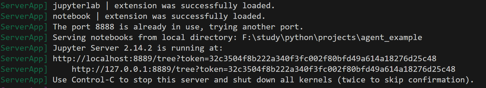
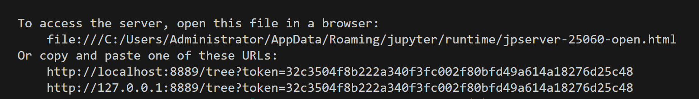
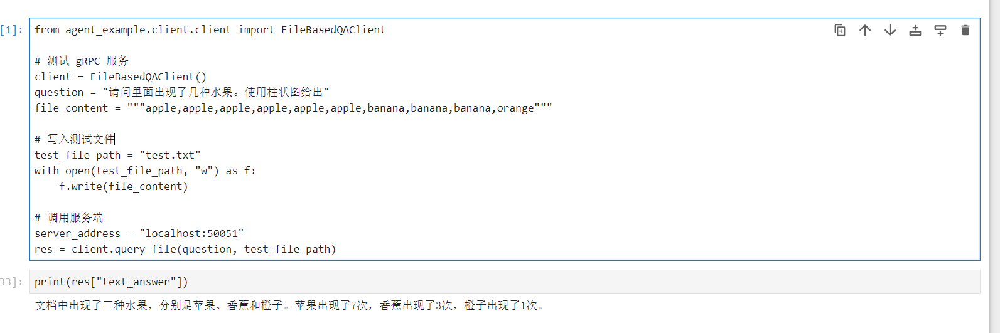
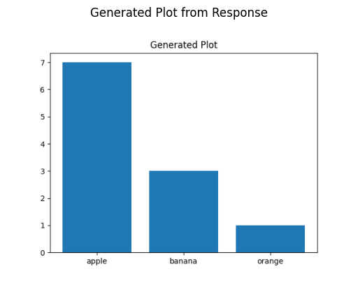

# 简易rpc式Agent实现

该项目实现了一个简易的文档对话agent,能够判断用户是否需要、并能够绘制柱状图的简易rpc式Agent。

在本篇文档中，只讲述如何把本项目运行起来，以及简单的设计。

需要进行自定义以及修改，请参考 [docs](./docs/) 目录中的其他文档

## 初步准备

1. 克隆本仓库到本地

1. 在本项目根目录创建一个 ` .env ` 文件，参考 ` .env.example ` 描述修改内容

## 环境配置

请进入一个具有`python 3.12`的命令行环境

在项目根目录使用命令下载本项目依赖，并创建虚拟环境。

``` bash
python -m pip install poetry
```

下载完毕后使用命令，启动服务端。

``` bash
poetry run python ./tests/start_server.py
```

在服务端启动的日志里可以看见大模型的输出内容。


新开一个命令行，使用下方命令启动jupyter服务。

``` bash
poetry run jupyter notebook
```

你将会看见类似如下的命令输出




在浏览器输入命令中出现的一个URL即可进入jupyter界面。

在浏览器的jupyter界面中打开 jupyters/test.ipynb 。

逐行运行每一个代码单元查看效果。

## 效果

传入文本以及文字输出。



绘制的图像效果



## 服务定义相关
参考 [protos文件说明](./docs/protos文件说明.md)

